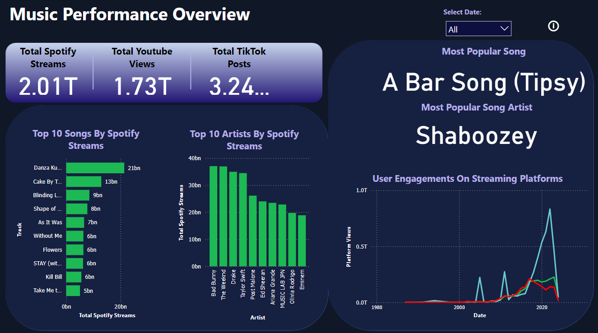
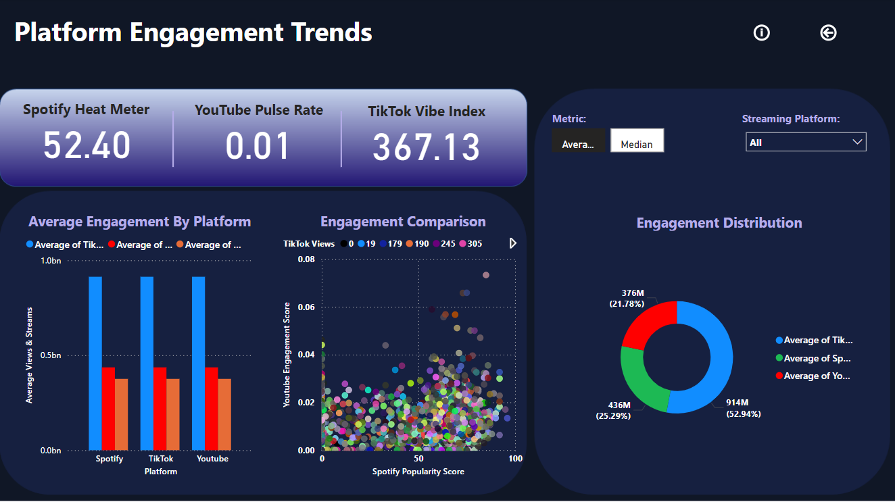
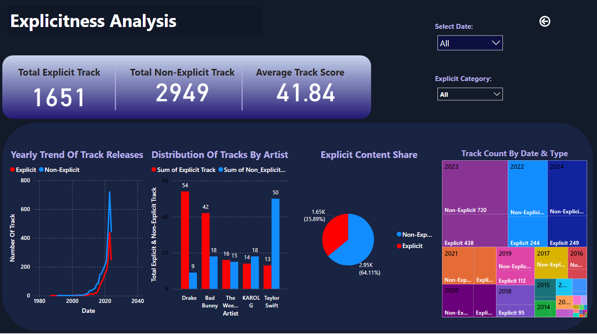

# Spotify Most Streamed Songs in 2024

A Power BI dashboard analyzing the most streamed songs on Spotify in 2024. It provides insights into artists, genres, and song popularity.

## Overview
- With data sourced from [Kaggle](https://www.kaggle.com), I developed dashboards that reveal key insights from the Spotify streamimg charts. This project demonstrates my ability to clean and analyse data, design visuals, and draw conclusions for decision making.

## 🔧 Tools Used
- Power BI
- Github (version control)

## 📊 Dashboard Features
- Top 10 most streamed songs globally in 2024
- Artist and genre breakdown
- Duration and popularity comparison
- Explicit and Inplicit songs comparison

## 🧠 Insights Delivered
- Which artists dominated the charts
- Genre popularity trends
- Correlation between duration and stream count

## 📁 Files Included
- Dashboard screenshots (,, , .)

## Author
**Ernest Yesufu**
Data Analyst | SQL, Python, Excel & Power BI
Based in United Kingdom

## 🔗 Live Portfolio View
https://ernestyesufu.github.io/

